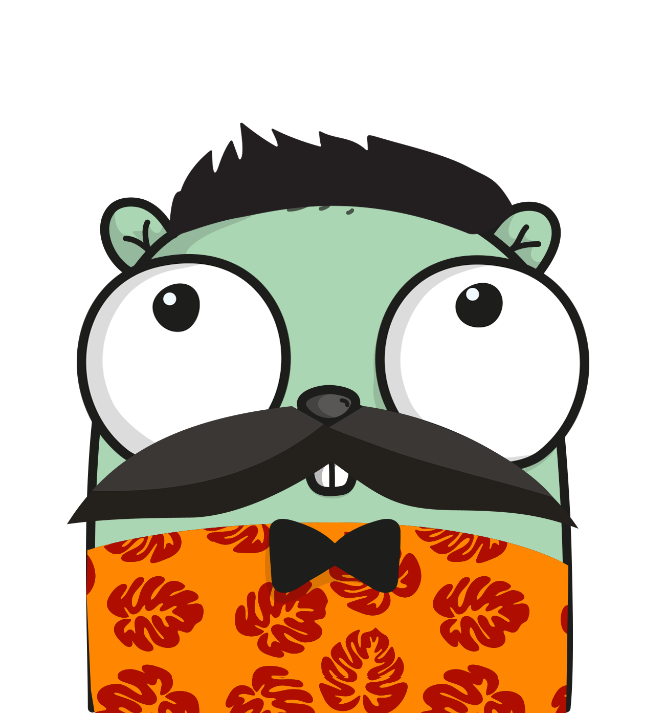

## Gola, A simple golang `Hello World` "full-*web*-stack" web application


  
Gopher created at [gopherize.me](https://gopherize.me)

Although I've never been a fan of the phrase "full-stack developer" (mainly due to the ambiguity of "stack"), I threw this together from an [app I am building](https://foxtrotguns.com) to learn web development. It seems that it qualifies as a "full-*web*-stack" using a single [language](https://golang.org/). I'm still not totally convinced, however, as html, javascript, and css are not go.

This can be built and run locally as follows (access in your browser at `127.0.0.1:8080`):

>```
>go get ./...
>go build
>./gola
>```

Or, if you don't want to worry about getting a go environment installed, [use nanobox](nanobox.io) and run the following, accessing in your browser at the address shown at the end):

>```
>nanobox deploy dry-run
>```

You should be greeted with "Hello world" in one of 12 languages. Refresh the page to be greeted in another.

Navigating to `/requests` will show you how many times you have been greeted (technically how many times the server has sent greetings in its lifetime)

#### TODO
- [ ] Consider not preloading the 404 page (for development only)
- [ ] Find image of gopher wearing sombrero
- [x] Make sure `nanobox deploy` works with this type of web app before giving it as an option